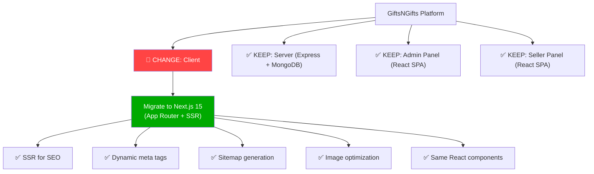

# 🔍 GiftsNGifts — Intensive Codebase Review & Tech Stack Recommendation

> **Review Date:** April 6, 2026  
> **Project:** GiftsNGifts E-Commerce Platform (giftsngifts.in)  
> **Current Stack:** React (Vite) + Express + MongoDB  
> **Modules Reviewed:** Client, Admin, Seller, Server (all 4)  
> **Primary Goal:** Rank on top of Google Search

---

## Executive Summary

| Area | Current Grade | Verdict |
|---|---|---|
| **SEO & Google Ranking** | 🔴 **F — Critical Failure** | **This is the #1 problem.** Your React SPA is invisible to Google. |
| **Backend (Express + MongoDB)** | 🟢 **B+ — Keep** | Well-structured, secure. Keep with improvements. |
| **Frontend (React + Vite SPA)** | 🔴 **D — Must Change** | Good component code, but SPA kills SEO entirely. |
| **Admin Panel** | 🟢 **A — Keep As-Is** | Internal tool, no SEO needed. React SPA is perfect. |
| **Seller Panel** | 🟢 **A — Keep As-Is** | Internal tool, no SEO needed. React SPA is perfect. |
| **Security** | 🟢 **A — Excellent** | Helmet, rate limiting, HttpOnly cookies, IDOR protection. |
| **Code Quality** | 🟡 **B — Good with issues** | Well-organized but some inconsistencies. |

> [!CAUTION]
> **The single biggest problem is: Your Client app is a React SPA (Single Page Application). Google's crawler sees an empty `<div id="root"></div>` with zero content on every page. Your site is essentially INVISIBLE to search engines.** No amount of keyword optimization, backlinks, or content writing will fix this. The tech stack itself must change for the Client.

---

## 1. 🔴 SEO Analysis — THE DEALBREAKER

### What Google Sees When It Crawls Your Site

When Googlebot visits `https://giftsngifts.in/products/xyz`, here is the **entire HTML** it receives:

```html
<!doctype html>
<html lang="en">
  <head>
    <meta charset="UTF-8" />
    <link rel="icon" type="image/svg+xml" href="/vite.svg" />
    <meta name="viewport" content="width=device-width, initial-scale=1.0" />
    <title>GiftsNGifts.in</title>               <!-- ❌ Same title on EVERY page -->
    <script src="https://checkout.razorpay.com/v1/checkout.js"></script>
  </head>
  <body className="font-serif">                  <!-- ❌ Bug: className in HTML -->
    <div id="root"></div>                         <!-- ❌ EMPTY! No content at all -->
    <script type="module" src="/src/main.jsx"></script>
  </body>
</html>
```

### Every SEO Requirement — Failed

| SEO Requirement | Status | Details |
|---|---|---|
| **Server-Side Rendering (SSR)** | ❌ Missing | Google sees empty `<div id="root"></div>` |
| **Dynamic `<title>` tags** | ❌ Missing | Every page shows "GiftsNGifts.in" |
| **Meta descriptions** | ❌ Missing | No `<meta name="description">` anywhere |
| **Open Graph tags** | ❌ Missing | No social sharing metadata |
| **JSON-LD Structured Data** | ❌ Missing | No Product, BreadcrumbList, Organization schema |
| **Sitemap.xml** | ❌ Missing | Google can't discover your pages |
| **Robots.txt** | ❌ Missing | No crawling directives |
| **Canonical URLs** | ❌ Missing | Risk of duplicate content penalties |
| **react-helmet** | ❌ Not installed | Comment in code says "would be added" but never was |
| **Per-page `<h1>` tags** | ⚠️ Partial | Some pages have them, but Google can't render them |
| **Image alt texts** | ⚠️ Partial | Product model has `altText` field but it defaults to `""` |
| **Breadcrumb markup** | ⚠️ Visual only | BreadcrumbList exists visually but no schema.org markup |
| **URL structure** | 🟡 Decent | `/products/:id`, `/occasion/:slug` — good patterns |
| **Product metaTitle/metaDescription** | 🟡 In DB | Fields exist in MongoDB but are **never rendered to HTML** |

> [!IMPORTANT]
> **The irony:** Your product model already has `metaTitle`, `metaDescription`, and `tags` fields. The backend is SEO-ready. But the frontend throws it all away because React SPA can't inject this into the HTML that Google sees.

---

## 2. Architecture Review — What's Good, What's Bad

### ✅ What's Working Well

#### Server (Express + MongoDB) — **Keep This**
- **Security is excellent**: Helmet, CORS, rate limiting, mongo-sanitize, HttpOnly JWT cookies, IDOR protection, mass-assignment prevention, token blacklisting
- **Well-structured**: Clean separation of routes → controllers → models → middleware
- **41 MongoDB models** covering products, users, sellers, orders, B2B, artisans, crafts, states — comprehensive data model
- **37 route files** — well-organized by feature domain
- **31 controllers** — proper business logic separation
- **Smart features**: Stock reservation system, seller inactivity sweep, bulk pricing tiers, Razorpay integration, OpenAI chatbot
- **Validation**: Zod for schema validation, proper input sanitization
- **Logging**: Winston for structured logging

#### Admin Panel (React + Vite) — **Keep As-Is**
- Internal tool — SEO irrelevant
- Chart.js + Recharts for analytics
- PDF/Excel export (jspdf, exceljs)
- MUI component library — good choice for admin dashboards
- React 19 — up to date

#### Seller Panel (React + Vite) — **Keep As-Is**
- Internal tool — SEO irrelevant
- Firebase integration for real-time features
- Proper auth flow with separate seller middleware
- MUI v7 — latest version
- Tailwind CSS v3 — fine for internal use

#### Client Code Quality — **Code is good, delivery method is wrong**
- Good lazy loading with `React.lazy()` and `Suspense`
- ErrorBoundary for crash recovery
- Clean component decomposition (ProductImageGallery, ProductInfoSection, ReviewList)
- Good use of `useCallback` to prevent unnecessary re-renders
- Share functionality, wishlist, cart logic — all well-implemented
- Accessibility: ARIA labels, roles, semantic HTML

### ❌ Critical Issues Found

#### Issue 1: React Version Mismatch Across Modules
```
Client:  React 18.3.1
Admin:   React 19.0.0
Seller:  React 19.0.0
```
The Client is on an older React version. This isn't catastrophic but it's sloppy.

#### Issue 2: CSS Framework Chaos
```
Client:  Tailwind v4 + @tailwindcss/vite + MUI + styled-components + Emotion
Admin:   Tailwind v4 + MUI + Emotion
Seller:  Tailwind v3 + MUI + Emotion (different Tailwind version!)
```
- **3 different CSS approaches in one project** — Tailwind, styled-components, AND Emotion
- Tailwind v3 in Seller vs v4 in Client/Admin — different config formats entirely
- This bloats bundle size and creates maintenance nightmares

#### Issue 3: `index.html` has HTML bug
```html
<body className="font-serif">  <!-- ❌ This is JSX syntax, not HTML -->
```
Should be `class="font-serif"`. `className` is React-specific and does nothing in raw HTML.

#### Issue 4: No Database Indexes
The Product model has **zero explicit indexes**. With 41 models and complex queries (filter by category, price range, state, occasion, giftFor), every query does a **full collection scan**. This will get extremely slow as data grows.

#### Issue 5: `filterProducts` has no pagination
```javascript
const products = await addproductmodel.find(filter).sort(sortOption);
// Returns ALL matching products at once — no limit, no skip
```
This will crash or timeout with large datasets.

#### Issue 6: Duplicate Icon Libraries
```
Client: react-icons + lucide-react + @mui/icons-material
```
Three icon libraries = massive bundle bloat. Pick ONE.

#### Issue 7: Dead/Deprecated Code
- `authMiddleware.js` is entire file marked DEPRECATED but still in codebase
- Commented-out CORS config block (~50 lines) in server.js
- Commented-out route components in App.jsx

---

## 3. 🎯 Tech Stack Recommendation

### The Verdict: What to Keep, What to Change



---

### 🔴 Client → Migrate to **Next.js 15** (App Router)

> [!IMPORTANT]
> **This is the ONLY change that matters for Google ranking.** Everything else is optional optimization.

#### Why Next.js?

| Feature | Current (React SPA) | Next.js |
|---|---|---|
| Server-Side Rendering | ❌ None | ✅ Built-in SSR & SSG |
| Dynamic Meta Tags | ❌ Impossible | ✅ `generateMetadata()` per page |
| Sitemap Generation | ❌ None | ✅ `sitemap.ts` auto-generation |
| robots.txt | ❌ None | ✅ `robots.ts` built-in |
| Open Graph Images | ❌ None | ✅ `opengraph-image.tsx` |
| JSON-LD Structured Data | ❌ None | ✅ Easy to inject per page |
| Image Optimization | ❌ Manual | ✅ `next/image` auto WebP/AVIF |
| Code Splitting | ✅ Manual lazy() | ✅ Automatic per route |
| ISR (Incremental Static Regen) | ❌ N/A | ✅ Product pages cached & refreshed |
| API Routes | ❌ Separate server | ✅ Can proxy or coexist |
| Your React Components | ✅ Work | ✅ **95% reusable as-is** |

#### What Migration Looks Like

Your existing React components (ProductImageGallery, ProductInfoSection, ReviewList, etc.) **stay almost identical**. The main changes are:

```
BEFORE (Current SPA):
  Client/
  ├── src/
  │   ├── App.jsx          ← All routes defined here
  │   ├── main.jsx         ← BrowserRouter entry
  │   └── Components/
  │       ├── Home/
  │       ├── ProductDetalis/
  │       └── ...

AFTER (Next.js App Router):
  Client/
  ├── app/
  │   ├── layout.tsx       ← Root layout (Header + Footer)
  │   ├── page.tsx         ← Home page (SSR)
  │   ├── products/
  │   │   └── [id]/
  │   │       └── page.tsx ← Product detail (SSR with meta)
  │   ├── occasion/
  │   │   └── [slug]/
  │   │       └── page.tsx ← Occasion page (SSR with meta)
  │   ├── artisan/
  │   │   └── [slug]/
  │   │       └── page.tsx ← Artisan profile (SSR)
  │   ├── sitemap.ts       ← Auto-generated sitemap
  │   └── robots.ts        ← Robots.txt
  └── components/          ← YOUR EXISTING COMPONENTS (moved here)
      ├── ProductImageGallery.jsx
      ├── ProductInfoSection.jsx
      └── ...
```

#### SEO You Get Automatically with Next.js

```tsx
// app/products/[id]/page.tsx
export async function generateMetadata({ params }) {
  const product = await fetch(`https://api.giftsngifts.in/api/products/${params.id}`).then(r => r.json());
  
  return {
    title: product.data.metaTitle || `${product.data.title} | GiftsNGifts`,
    description: product.data.metaDescription || product.data.description?.substring(0, 160),
    openGraph: {
      title: product.data.title,
      description: product.data.description,
      images: [product.data.images?.[0]?.url],
      type: 'product',
    },
    // JSON-LD Structured Data
    other: {
      'script:ld+json': JSON.stringify({
        '@context': 'https://schema.org',
        '@type': 'Product',
        name: product.data.title,
        description: product.data.description,
        image: product.data.images?.map(i => i.url),
        offers: {
          '@type': 'Offer',
          price: product.data.price,
          priceCurrency: 'INR',
          availability: product.data.isAvailable 
            ? 'https://schema.org/InStock' 
            : 'https://schema.org/OutOfStock',
        },
        aggregateRating: {
          '@type': 'AggregateRating',
          ratingValue: product.data.rating,
          reviewCount: product.data.reviewCount,
        }
      })
    }
  };
}
```

#### Sitemap Auto-Generation
```tsx
// app/sitemap.ts
export default async function sitemap() {
  const products = await fetch('https://api.giftsngifts.in/api/products/all-slugs').then(r => r.json());
  
  return [
    { url: 'https://giftsngifts.in', changeFrequency: 'daily', priority: 1 },
    { url: 'https://giftsngifts.in/shop-by-occasion', changeFrequency: 'weekly', priority: 0.9 },
    { url: 'https://giftsngifts.in/artisans', changeFrequency: 'weekly', priority: 0.8 },
    ...products.map(p => ({
      url: `https://giftsngifts.in/products/${p._id}`,
      lastModified: p.updatedAt,
      changeFrequency: 'weekly',
      priority: 0.7,
    })),
  ];
}
```

---

### ✅ Server (Express + MongoDB) — **KEEP, Enhance**

Your backend is solid. Here's what to improve:

#### Add Database Indexes (Critical for Performance)
```javascript
// In addproduct.js model — add BEFORE export
addproductSchema.index({ categoryname: 1, approved: 1, isAvailable: 1 });
addproductSchema.index({ subcategory: 1 });
addproductSchema.index({ price: 1 });
addproductSchema.index({ sellerId: 1 });
addproductSchema.index({ state: 1 });
addproductSchema.index({ occasions: 1 });
addproductSchema.index({ giftFor: 1 });
addproductSchema.index({ tags: 1 });
addproductSchema.index({ title: 'text', description: 'text', tags: 'text' }); // Full-text search
addproductSchema.index({ createdAt: -1 });
addproductSchema.index({ isFeatured: 1, approved: 1 });
```

#### Add Pagination to All List Endpoints
```javascript
// Example fix for filterProducts
const page = parseInt(req.query.page) || 1;
const limit = parseInt(req.query.limit) || 24;
const skip = (page - 1) * limit;

const [products, total] = await Promise.all([
  addproductmodel.find(filter).sort(sortOption).skip(skip).limit(limit).lean(),
  addproductmodel.countDocuments(filter)
]);

res.status(200).json({ 
  success: true, 
  data: products, 
  pagination: { page, limit, total, pages: Math.ceil(total / limit) }
});
```

#### Add a Public Products Endpoint for SEO
Your current `getAllProducts` requires seller auth. You need a public endpoint for the Next.js frontend:

```javascript
// New route: GET /api/public/products — no auth required
export const getPublicProducts = async (req, res) => {
  const products = await addproductmodel.find({ approved: true, isAvailable: true })
    .select('title price oldprice discount images rating reviewCount state metaTitle metaDescription')
    .lean();
  res.json({ success: true, data: products });
};
```

---

### ✅ Admin Panel — **KEEP AS-IS**

No changes needed. It's an internal dashboard:
- SEO is irrelevant (it's behind login)
- React SPA is the correct choice for admin tools
- MUI + Recharts + Chart.js are great for dashboards
- PDF/Excel export (jspdf, exceljs) works well

---

### ✅ Seller Panel — **KEEP AS-IS**

Same reasoning as Admin:
- Internal tool behind login
- React SPA is appropriate
- Firebase for real-time notifications is good
- Only minor cleanup needed (align Tailwind version with Admin if desired)

---

## 4. Migration Priority & Effort Estimate

### Phase 1: 🔴 SEO Emergency (1-2 weeks)
> This alone will get you indexed by Google

| Task | Effort | Impact |
|---|---|---|
| Initialize Next.js 15 in Client folder | 1 day | Foundation |
| Move existing React components to Next.js | 2-3 days | Component reuse |
| Implement SSR for Home, Product, Category pages | 3-4 days | **CRITICAL for SEO** |
| Add `generateMetadata()` to all pages | 1 day | **Dynamic titles, descriptions** |
| Create `sitemap.ts` and `robots.ts` | 0.5 day | **Google discovery** |
| Add JSON-LD structured data (Product, Org, Breadcrumb) | 1 day | **Rich snippets in Google** |

### Phase 2: 🟡 Performance (3-5 days)
| Task | Effort | Impact |
|---|---|---|
| Add MongoDB indexes | 0.5 day | 10-100x faster queries |
| Add pagination to all list endpoints | 1 day | Prevents timeouts |
| Use `next/image` for auto WebP/AVIF | 1 day | 60-80% image size reduction |
| Consolidate icon libraries (pick one) | 0.5 day | Smaller bundle |
| Remove dead/deprecated code | 0.5 day | Cleanliness |

### Phase 3: 🟢 Polish (Ongoing)
| Task | Effort | Impact |
|---|---|---|
| Implement ISR for product pages | 1 day | Cached SSR (best of both worlds) |
| Add Google Search Console + Analytics | 0.5 day | Track rankings |
| Submit sitemap to Google | 0.5 day | Faster indexing |
| Add `og:image` generation for social sharing | 1 day | Better social previews |
| Align Tailwind versions across modules | 1 day | Consistency |
| Remove styled-components from Client | 1 day | Reduce CSS framework chaos |

---

## 5. Final Tech Stack Recommendation

```
┌──────────────────────────────────────────────────────────────────┐
│                    RECOMMENDED TECH STACK                         │
├──────────────────────────────────────────────────────────────────┤
│                                                                  │
│  CLIENT (Customer-Facing)                                        │
│  ┌────────────────────────────────────────────────┐              │
│  │  🔄 CHANGE → Next.js 15 (App Router)           │              │
│  │  ✅ KEEP   → React components (reuse 95%)      │              │
│  │  ✅ KEEP   → Tailwind CSS v4                   │              │
│  │  ✅ KEEP   → Framer Motion                     │              │
│  │  ❌ DROP   → styled-components (redundant)     │              │
│  │  ❌ DROP   → 2 of 3 icon libraries             │              │
│  │  ➕ ADD    → next-sitemap / built-in sitemap   │              │
│  │  ➕ ADD    → next/image for optimization        │              │
│  └────────────────────────────────────────────────┘              │
│                                                                  │
│  SERVER (API)                                                    │
│  ┌────────────────────────────────────────────────┐              │
│  │  ✅ KEEP   → Express.js                        │              │
│  │  ✅ KEEP   → MongoDB + Mongoose                │              │
│  │  ✅ KEEP   → All security middleware            │              │
│  │  ✅ KEEP   → Razorpay, Cloudinary, Nodemailer  │              │
│  │  ➕ ADD    → MongoDB indexes                    │              │
│  │  ➕ ADD    → Pagination on all list endpoints   │              │
│  │  ➕ ADD    → Public product endpoints for SSR   │              │
│  └────────────────────────────────────────────────┘              │
│                                                                  │
│  ADMIN PANEL                                                     │
│  ┌────────────────────────────────────────────────┐              │
│  │  ✅ KEEP   → React 19 + Vite (SPA is correct)  │              │
│  │  ✅ KEEP   → MUI + Recharts + Chart.js         │              │
│  └────────────────────────────────────────────────┘              │
│                                                                  │
│  SELLER PANEL                                                    │
│  ┌────────────────────────────────────────────────┐              │
│  │  ✅ KEEP   → React 19 + Vite (SPA is correct)  │              │
│  │  ✅ KEEP   → MUI + Firebase                    │              │
│  └────────────────────────────────────────────────┘              │
│                                                                  │
└──────────────────────────────────────────────────────────────────┘
```

---

## 6. Answering the Client's Question Directly

> *"Should we change the tech stack?"*

### Short Answer:
**Only the Customer-Facing Client needs to change.** Everything else stays.

### Why:

| Component | Change? | Reason |
|---|---|---|
| **Client** | **YES → Next.js** | React SPA = zero SEO. Google literally cannot see your products. This is the #1 reason you won't rank. Next.js gives you SSR + all SEO features with minimal code changes since it's still React. |
| **Server** | **NO** | Express + MongoDB is an excellent choice for e-commerce APIs. Your security setup is better than 90% of projects I've seen. Just add indexes and pagination. |
| **Admin** | **NO** | Admin dashboards should be SPAs. No customer ever googles your admin panel. |
| **Seller** | **NO** | Same as Admin. Internal tool, SPA is the right choice. |
| **MongoDB** | **NO** | Perfect for your use case. Product catalog with varied attributes, flexible schema for categories, good aggregation pipeline support. |

### The Non-Negotiable:
If your website needs to **rank on Google**, the Client MUST have Server-Side Rendering. There are only two practical options:
1. **Next.js** (recommended — it's just React with SSR)
2. **Nuxt.js** (requires rewriting everything in Vue.js — NOT recommended)

Next.js lets you keep 95% of your existing React code. The migration is a **restructuring**, not a rewrite.

---

> [!TIP]
> **Quick Win:** Even before the full migration, you can immediately improve SEO by:
> 1. Adding `robots.txt` and `sitemap.xml` to the `Client/public/` folder
> 2. Fixing the `<body className=...>` bug in `index.html`  
> 3. Adding basic `<meta>` tags to `index.html`
> 
> But these are band-aids. The real fix is SSR via Next.js.
